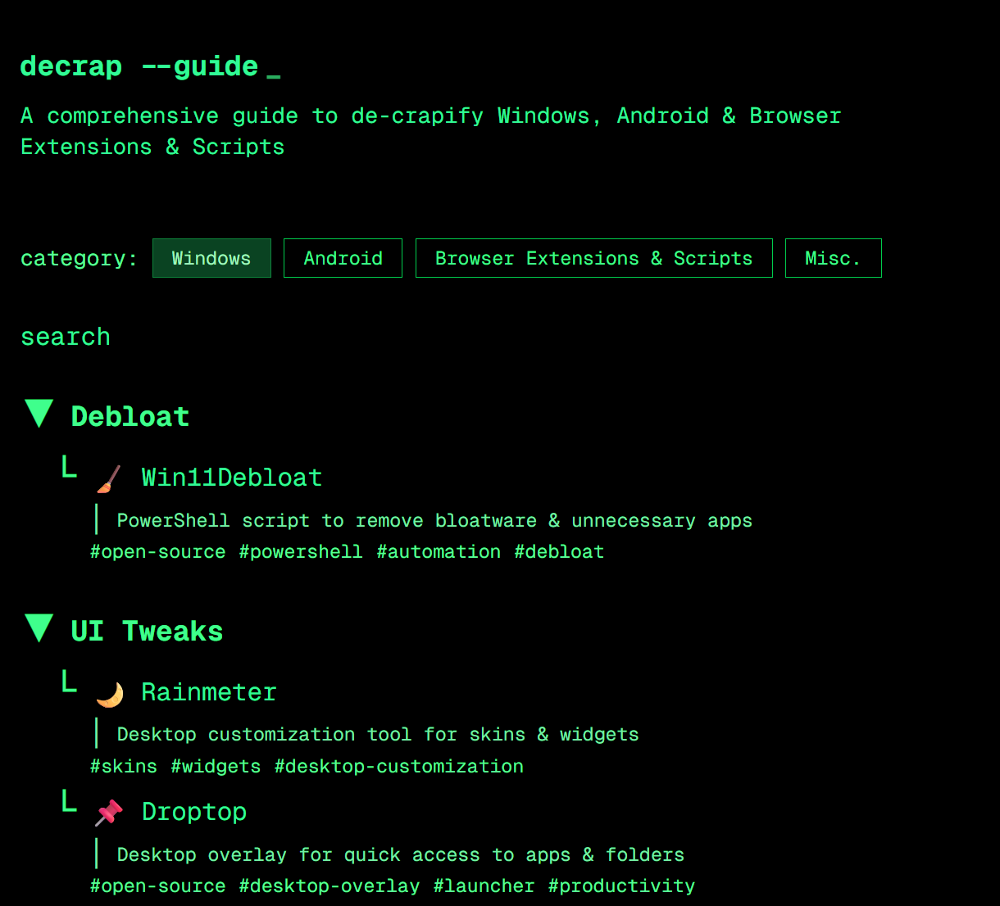

# UnsuckWindows



A small, modern Next.js app for documenting Windows cleanup and privacy tweaks. It is built with Next.js 16, React 19, and Tailwind CSS.

## What is this project?

`UnsuckWindows` is a front-end project that showcases a Windows-focused utility guide and debloat workflow. It provides a clean landing page, quick install/run instructions, and a visual demo of the app.

## Features

- Next.js app using the App Router
- Modern React 19 support
- Tailwind CSS styling via `@tailwindcss/postcss`
- Easy local development with `npm run dev`
- Simple static deployment ready for Vercel or any static-compatible host

## Quick Start

```bash
npm install
npm run dev
```

Then open [http://localhost:3000](http://localhost:3000) in your browser.

## Available Scripts

- `npm run dev` - start the local development server
- `npm run build` - build the production app
- `npm start` - run the built app in production mode
- `npm run lint` - run ESLint checks

## Project Structure

- `app/` - main application folder for Next.js pages and layouts
- `app/page.tsx` - home page content
- `app/layout.tsx` - root layout for the app
- `app/components/` - reusable UI components
- `public/` - static assets, including `screenshot.png`

## Notes

This project was created with [`create-next-app`](https://nextjs.org/docs/app/api-reference/cli/create-next-app) and uses the App Router pattern for modern Next.js development.

## Learn More

- [Next.js Documentation](https://nextjs.org/docs)
- [Tailwind CSS](https://tailwindcss.com)
- [Vercel Deployment](https://vercel.com/new?utm_medium=default-template&utm_source=create-next-app)
